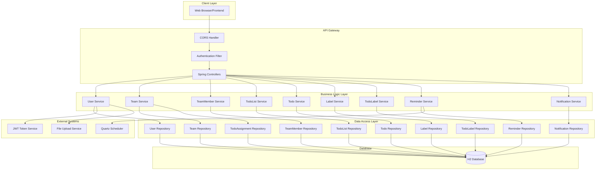
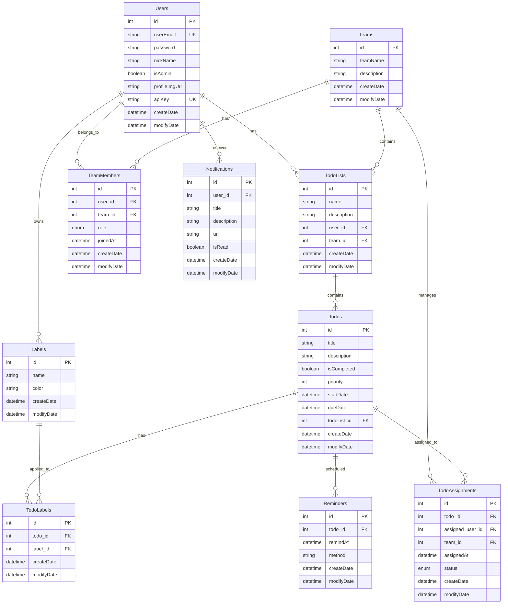
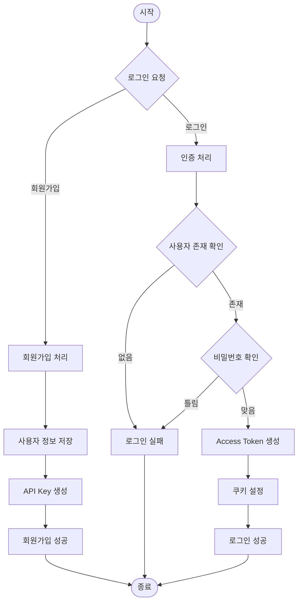
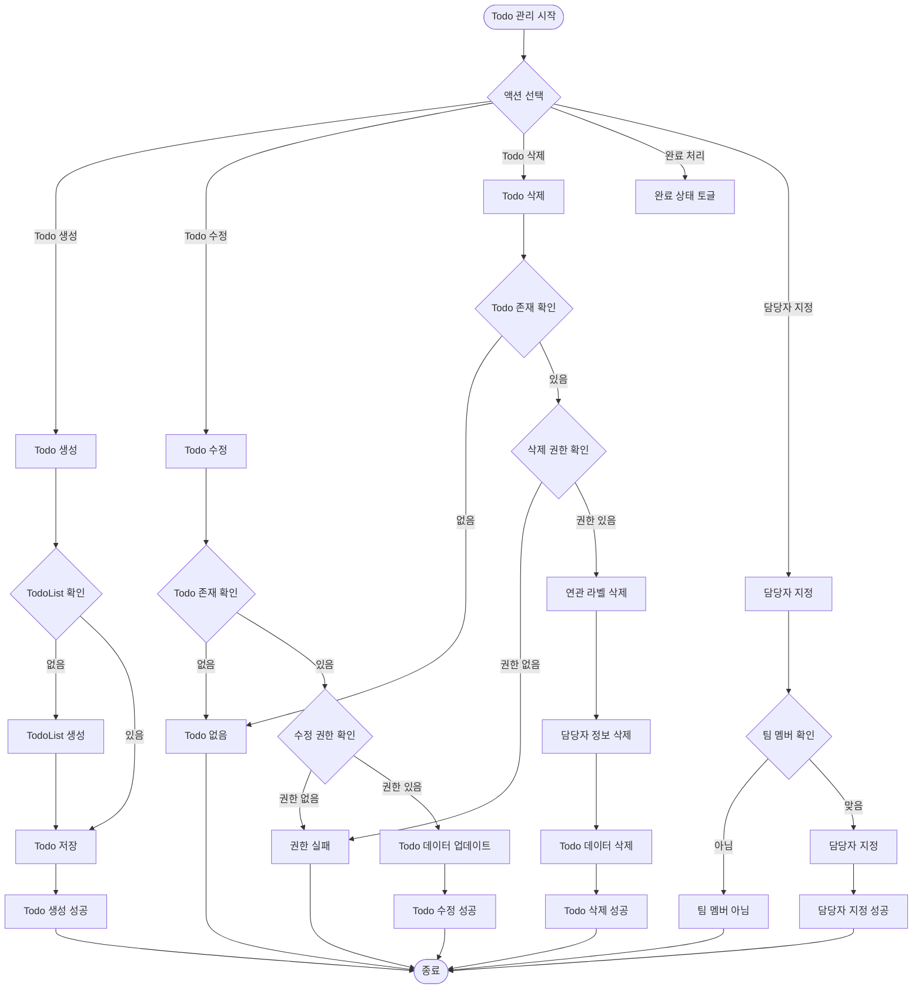
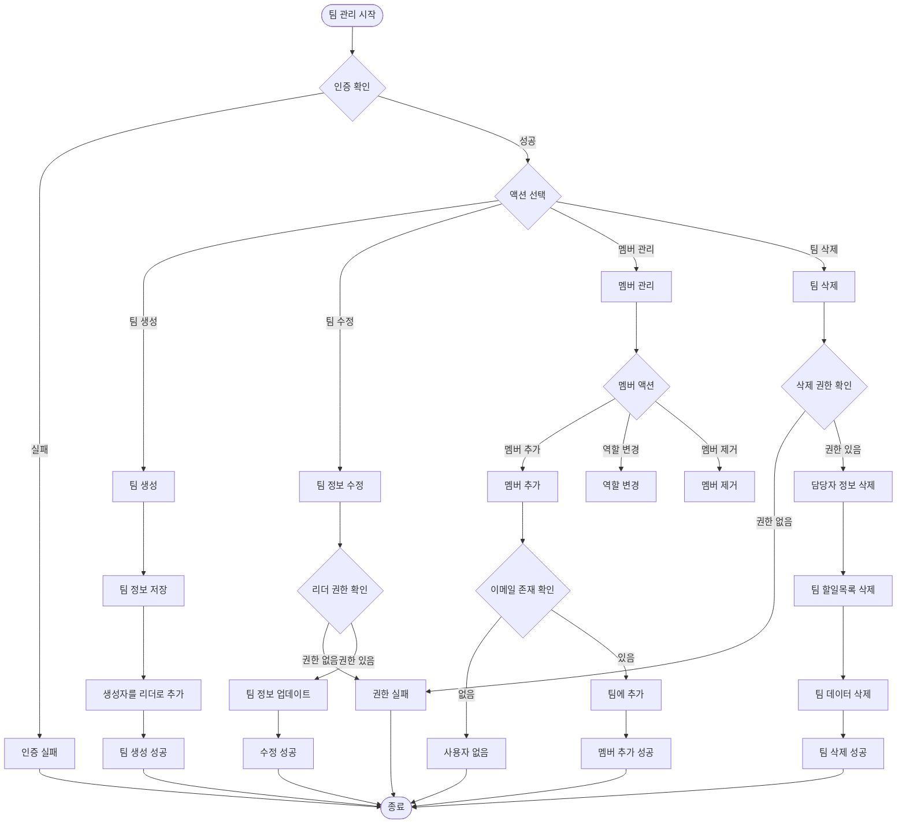
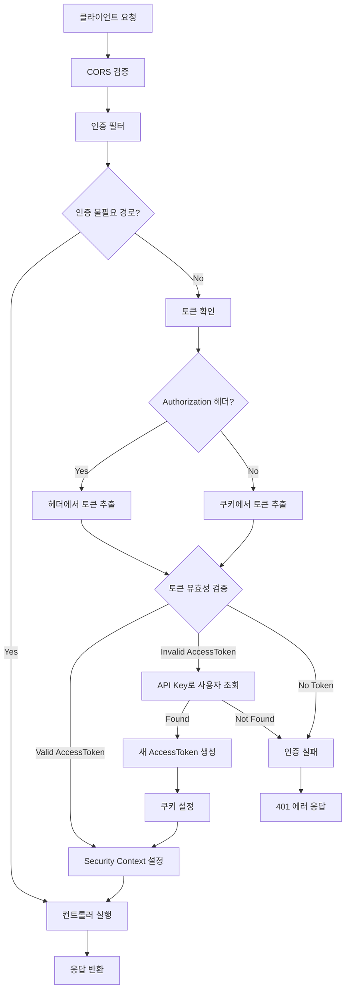

# devcourse-NBE6-8-2-Team03 - TodoDuk
NBE6-8-2-Team03 사이보이즈

## 📋 프로젝트 개요

**TodoDuk**은 개인 및 팀 할일 관리를 위한 웹 애플리케이션입니다. Spring Boot를 기반으로 한 REST API 백엔드로 구성되어 있으며, 할일 관리, 팀 협업, 라벨링, 알림 등의 기능을 제공합니다.

### 🛠 주요 기술 스택
- **Backend**: Spring Boot 3.5.4, JPA/Hibernate, Spring Security
- **Database**: H2 (개발환경)
- **Authentication**: JWT + API Key
- **Scheduler**: Quartz
- **API Documentation**: Swagger/OpenAPI 3

---

### Backend (Spring Boot)
- **Framework**: Spring Boot 3.5.3
- **Language**: Java 21
- **Database**: H2 (개발), MySQL (운영 지원)
- **Cache**: Redis (토큰 저장소)
- **Security**: Spring Security + JWT
- **Documentation**: SpringDoc OpenAPI 3.x (Swagger)
- **Build Tool**: Gradle 8.14.3 (Kotlin DSL)

### Frontend (Next.js)
- **Framework**: Next.js 15.4.1
- **Language**: TypeScript
- **Styling**: Tailwind CSS 4.0
- **State Management**: Zustand
- **HTTP Client**: Axios
- **UI Components**: Radix UI, Lucide React
- **Dev Tools**: ESLint, Prettier

### DevOps & Tools
- **CI/CD**: GitHub Actions
- **API Generation**: swagger-typescript-api
- **Development**: Docker (Redis)

## 🏗️ 프로젝트 구조

### 시스템 아키텍처 다이어그램 
---

---

### 📊 데이터베이스 ERD


---
### 🔄 시스템 플로우차트

#### 사용자 인증 플로우 


#### TODO 관리 플로우


#### 팀팀 관리 플로우


#### Use Case 다이어그램

```mermaid
graph LR
    subgraph "Actors"
        U[User]
        TL[Team Leader]
        TM[Team Member]
        SYS[System]
    end
    
    subgraph "Authentication & User Management"
        UC1[Register Account]
        UC2[Login/Logout]
        UC3[View Profile]
        UC4[Update Profile]
        UC5[Upload Profile Image]
    end
    
    subgraph "Todo Management"
        UC6[Create Todo]
        UC7[Update Todo]
        UC8[Delete Todo]
        UC9[Mark Complete]
        UC10[View Todos]
        UC11[Filter Todos]
    end
    
    subgraph "Todo List Management"
        UC12[Create Todo List]
        UC13[Update Todo List]
        UC14[Delete Todo List]
        UC15[View Todo Lists]
    end
    
    subgraph "Label Management"
        UC16[Create Label]
        UC17[Apply Labels to Todo]
        UC18[Remove Labels]
        UC19[View Labels]
    end
    
    subgraph "Team Management"
        UC20[Create Team]
        UC21[Update Team Info]
        UC22[Delete Team]
        UC23[View Team Details]
        UC24[Add Team Member]
        UC25[Remove Team Member]
        UC26[Change Member Role]
        UC27[View Team Stats]
    end
    
    subgraph "Team Todo Management"
        UC28[Create Team Todo]
        UC29[Assign Todo to Member]
        UC30[Unassign Todo]
        UC31[View Team Todos]
        UC32[Track Assignment History]
    end
    
    subgraph "Reminder & Notification"
        UC33[Create Reminder]
        UC34[Delete Reminder]
        UC35[View Reminders]
        UC36[Receive Notifications]
        UC37[Mark Notification Read]
        UC38[Schedule Reminder Job]
    end
    
    %% User relationships
    U --> UC1
    U --> UC2
    U --> UC3
    U --> UC4
    U --> UC5
    U --> UC6
    U --> UC7
    U --> UC8
    U --> UC9
    U --> UC10
    U --> UC11
    U --> UC12
    U --> UC13
    U --> UC14
    U --> UC15
    U --> UC16
    U --> UC17
    U --> UC18
    U --> UC19
    U --> UC33
    U --> UC34
    U --> UC35
    U --> UC36
    U --> UC37
    
    %% Team Leader relationships
    TL --> UC20
    TL --> UC21
    TL --> UC22
    TL --> UC24
    TL --> UC25
    TL --> UC26
    
    %% Team Member relationships
    TM --> UC23
    TM --> UC27
    TM --> UC28
    TM --> UC29
    TM --> UC30
    TM --> UC31
    TM --> UC32
    
    %% System relationships
    SYS --> UC38
```


#### 보안 아키텍쳐 

---
## 📊 주요 비즈니스 플로우

### 팀 생성 및 관리
1. **팀 생성**: 사용자가 팀을 생성하면 자동으로 리더 권한 부여
2. **멤버 초대**: 리더만 새로운 멤버 추가 가능 (이메일 기반)
3. **권한 관리**: 리더는 멤버 역할 변경 및 제거 가능
4. **팀 삭제**: 마지막 리더는 제거 불가, 팀 삭제 시 관련 데이터 연쇄 삭제

### 할일 할당 시스템
1. **개인 할일**: 사용자 개별 관리
2. **팀 할일**: 팀 멤버만 생성/수정 가능
3. **할일 할당**: 팀 멤버를 할일에 담당자로 지정
4. **할당 기록**: 모든 할당 변경사항 추적 및 이력 관리

### 알림 시스템
1. **리마인더 설정**: 할일에 대한 시간 기반 알림 설정
2. **스케줄링**: Quartz를 통한 백그라운드 작업 실행
3. **알림 생성**: 예정된 시간에 알림 자동 생성
4. **알림 관리**: 사용자별 알림 조회 및 읽음 처리
---
---

## 🚀 주요 기능

### ✨ 핵심 기능
- **사용자 인증**: JWT + API Key 기반 보안 시스템
- **개인 할일 관리**: CRUD, 우선순위, 마감일, 완료 상태 관리
- **팀 협업**: 팀 생성, 멤버 관리, 역할 기반 권한 제어
- **팀 할일 관리**: 팀원 간 할일 공유 및 담당자 지정
- **라벨링**: 색상 기반 라벨로 할일 분류
- **리마인더**: 시간 기반 알림 스케줄링
- **파일 업로드**: 프로필 이미지 관리

### 🔧 기술적 특징
- **RESTful API**: 표준 REST 아키텍처
- **트랜잭션 관리**: Spring의 선언적 트랜잭션
- **예외 처리**: 전역 예외 처리기로 일관된 오류 응답
- **데이터 검증**: Bean Validation을 통한 입력 데이터 검증
- **CORS 지원**: 프론트엔드와의 안전한 통신
- **API 문서화**: Swagger/OpenAPI 3 자동 문서 생성

---


### branch 규칙

태그 종류
- `feature`: 새로운 기능 추가 (feature)
- `fix`: 버그 수정
- `chore`: 코드 변경이 아닌 빌드, 설정, 문서 수정 등 잡일성 작업
- `docs`: 문서 수정
- `style`: 코드 포맷팅, 세미콜론 누락 등 코드 스타일 관련 변경
- `refactor`: 리팩토링 (기능 변화 없이 코드 구조 개선)
- `test`: 테스트 추가/수정
- `perf`: 성능 개선
[기술 분야] / [작업 종류] / [이슈넘버]-[구현 기능]
Ex)   `be/feature/1-login`
여기서 이슈 넘버는 **git issue** 등록 시 나오는 숫자로 한다

### commit 규칙
앞에 [BE], [FE] 로 구분해주기
```bash
//[**본인 영역**] **commit 종류** : commit 내용
**[FE] feature: 로그인 화면 추가**   //front 영역 feat(새 기능 추가)에서 로그인 기능 추가
**[BE] fix :f**                   //backend 영역 fix(버그 수정)에서 버그를 수정함
//터미널 명령어 예시
git commit -m “[FE] feat: 로그인 화면 추가”
```
### **협업규칙**
1. 작업 전, Issues에 자신의 작업을 등록해주세요. 백엔드 작업의 경우 -> [BE] 이슈이름
2. 작업은 main 브랜치가 아닌 작업용 브랜치를 따로 만들어서 진행해주세요.
3. 작업 진행중 커밋을 진행시, 아래의 Commit Message Convention을 참고하여 진행해주세요.
4. 작업에서 하나의 커밋 진행 후, `git pull origin main --rebase`를 통해 작업 브랜치의 최신화를 유지해주세요.
5. 작업이 끝나면 해당 작업을 브랜치에 push 후 main branch와 Squash merge 해주세요.
6. merge 후에는 브런치를 삭제해주시고, `git fetch --prune`을 통해 로컬에 남아있는 원격 레포지토리를 정리해주세요.
### PR 규칙
1. 기본적으로 구현할 때마다 새 branch 생성 후, 작성하기
2. `main` branch에는 해당 기능 구현 완료되었을 때만 pr을 통한 병합 요청
3. pr을 단순히 코드리뷰 용으로 사용할 경우 `draft pull request 사용`(reviewer가 확인해도 병합 안되니 마음 편히 사용가능)
### 어노테이션 규칙
저희 어노테이션 작성할 때 배치 순서에 대해서 간략하게 얘기하자면 일단 가장 기본적인 틀은 아래 규칙을 지켜주세요
어노테이션 배치 관례 (클래스 레벨)
1. Lombok 어노테이션: @Getter, @Setter, @NoArgsConstructor, @AllArgsConstructor, @Builder 등은 클래스 전체에 영향을 주므로 가장 먼저(맨 위) 작성
2. Spring/Framework 어노테이션: @Component, @Service, @Controller, @RestController 등이 있다면 Lombok 어노테이션 바로 아래에 배치
3. JPA Entity 어노테이션: @Entity, @Table 등은 Lombok, Spring/Framework 다음에 배치
4. 공통 설정 어노테이션: 주로 @RequestMapping처럼 특정 기능에 대한 공통 경로를 지정하는 어노테이션을 둡니다.
5. 문서화/메타데이터 어노테이션: Swagger/OpenAPI의 @Ta...
1. Lombok 어노테이션: @Getter, @Setter, @NoArgsConstructor, @AllArgsConstructor, @Builder 등은 클래스 전체에 영향을 주므로 가장 먼저(맨 위) 작성
2. Spring/Framework 어노테이션: @Component, @Service, @Controller, @RestController 등이 있다면 Lombok 어노테이션 바로 아래에 배치
3. JPA Entity 어노테이션: @Entity, @Table 등은 Lombok, Spring/Framework 다음에 배치
4. 공통 설정 어노테이션: 주로 @RequestMapping처럼 특정 기능에 대한 공통 경로를 지정하는 어노테이션을 둡니다.
5. 문서화/메타데이터 어노테이션: Swagger/OpenAPI의 @Ta...
